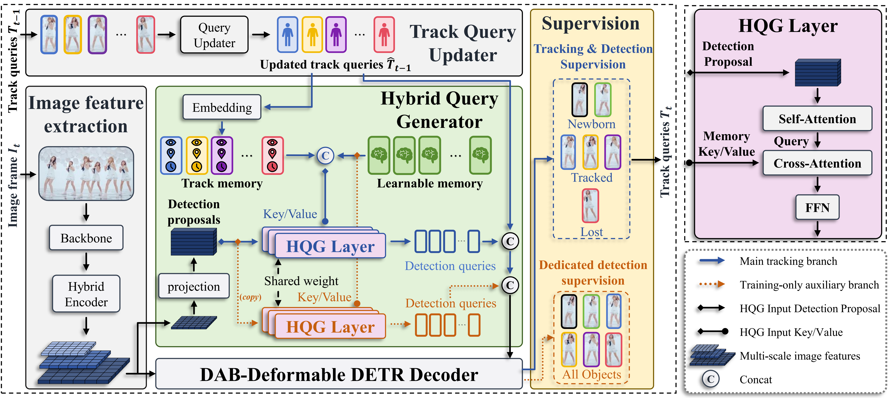

# TAQ_MOTR

## 📖 Overview

> **TAQ-MOTR** makes detection queries aware of existing track states, enabling the detection queries in Tracking-by-Propagation (TBP) trackers to move from DETR-style single-frame whole-image detection toward MOT-specific goals:
> - Discovering previously untracked newborn objects
> - Focusing on complex regions that offer extra cues for track queries.

The demo below shows four panels: original frame (top-left), Generative queries (top-right), Learnable queries (bottom-left), and TAQ-MOTR (ours, bottom-right). We recommend watching the attention shift around frame 1, where the tracker is initialized, and around frame 368, where a newborn target appears.

  <video src="https://github.com/user-attachments/assets/80948dee-ba0b-4f3e-88d4-0140220d531b" controls width="960" height="540"></video>

## 🔥 News

- **2026.07.13**: 🚀 We have released the source code and checkpoints for reproducing our experiments. Detailed training configurations will be made publicly available after the paper is accepted。

- **2026.06.18**: 🚧 We have built the full project and provided video examples for the model attention visualization. The HQG module code is now public, and the complete version will be fully released after the paper review stage is complete.

## 👀 Performance

### DanceTrack

| **Methods**  | **HOTA $\uparrow$** | **DetA $\uparrow$** | **AssA $\uparrow$** | **MOTA $\uparrow$** | **IDF1 $\uparrow$** |                     **checkpoint**                      |
| :------------: | :-----------------: | :-----------------: | :-----------------: | :-----------------: | :----------------: | :-----------------------------------------------------: |
| **TAQ-MOTR** |        72.0         |        82.4         |        63.1         |        91.7         |        76.6        | [Google][DanceTrack-google] / [Baidu][DanceTrack-baidu] |

### SportsMOT

| **Methods**                | **HOTA $\uparrow$** | **DetA $\uparrow$** | **AssA $\uparrow$** | **MOTA $\uparrow$** | **IDF1 $\uparrow$** |                   **checkpoint**                    |
| :--------------------------: | :-----------------: | :-----------------: | :-----------------: | :-----------------: | :----------------: | :-------------------------------------------------: |
| **TAQ-MOTR**       |        72.2         |        84.1         |        63.3         |        93.6         |        73.0        | [Google][SportMOT-google] / [Baidu][SportMOT-baidu] |
| **TAQ-MOTR Mix** |        74.6         |        84.9         |        65.6         |        94.7         |        77.8        | [Google][SportMOT-google] / [Baidu][SportMOT-baidu] |

## 🔧 Quick Start

- See **[INSTALL.md]** for instructions on installing the required components.
- See **[QUICK_START.md]** for quick-start instructions on model training, inference, and evaluation.
- See **[Visualization examples](doc/QUICK_START.md#9-visualization-examples)** for reproducing the README attention demo and offline renderings.

## :tada: Acknowledgements

This project is built upon [MeMOTR] and incorporates components from [RT-DETRv2], [Deformable-DETR], [DAB-DETR], and [TrackEval]. We thank the contributors of these excellent codebases.

## Citation

The paper is currently under review. BibTeX will be added once it is available.

[DanceTrack-google]: https://drive.google.com/file/d/1o6AStF-OoG7edE7TBYFVVTZnxbvUde32/view?usp=sharing
[DanceTrack-baidu]: https://pan.baidu.com/s/1J-4PKw4vKr28FcrYlxUbJQ?pwd=ajpd
[SportMOT-google]: https://drive.google.com/file/d/16OcPjhkYBHwov7IPZEIjZ2hM2nUoy9Zj/view?usp=sharing
[SportMOT-baidu]: https://pan.baidu.com/s/1WVFPfYvUCl2pYZUBA2xxMQ?pwd=zy9s
[MeMOTR]: https://github.com/MCG-NJU/MeMOTR
[Deformable-DETR]: https://github.com/fundamentalvision/Deformable-DETR
[DAB-DETR]: https://github.com/IDEA-Research/DAB-DETR
[RT-DETRv2]: https://github.com/zheli-hub/RT-DETRv2
[TrackEval]: https://github.com/JonathonLuiten/TrackEval
[INSTALL.md]: doc/INSTALL.md
[QUICK_START.md]: doc/QUICK_START.md
